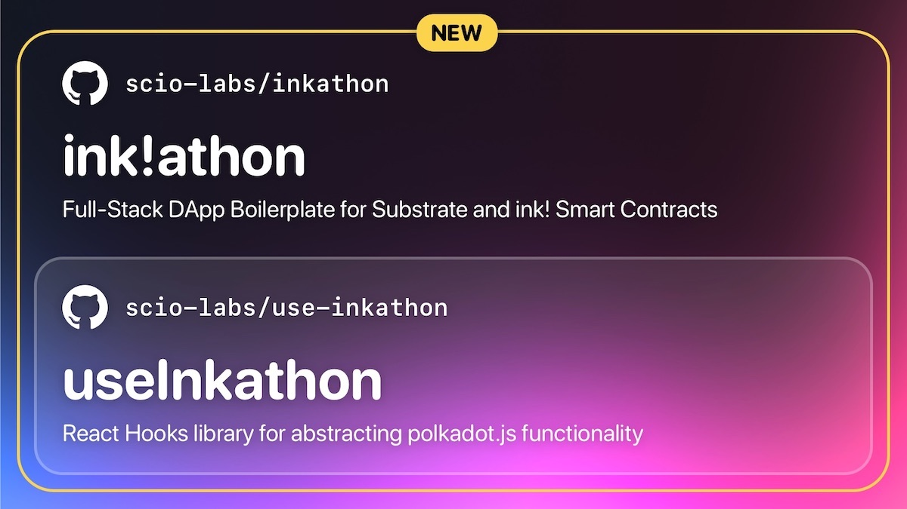

# ETHathon – Smart Contract & DApp Development Boilerplate


This is an opinionated boilerplate/starterkit/scaffold to get up and running with smart contract & dApp development. Also comes in handy for hackathons. 👀

By [Dennis Zoma](https://twitter.com/dennis_zoma) 🧙‍♂️



## Disclaimer

This is **work-in-progress**, there are open tasks, and there is no full documentation available yet.

## The Stack

- Package-Manager: `pnpm`
- Monorepo Tooling: `turborepo`
- Smart Contract Development: `hardhat`
  - Deploy & Address-Export: `hardhat-deploy`
  - Typescript-Types: `typechain`
- Frontend: `next`
  - Contract Interactions: `wagmi`, `rainbowkit`
  - Styling: `tailwindcss`
  - Styled Components: `twin.macro`, `emotion`
- Misc:
  - Linting & Formatting: `eslint`, `prettier`
  - Actions on Git Hooks: `husky`, `lint-staged`

## Getting Started

```bash
# Install pnpm
npm i -g pnpm

# Install dependencies
pnpm install

# Copy & fill environments
cp packages/frontend/.env.local.example packages/frontend/.env.local
cp packages/contracts/.env.example packages/contracts/.env
```

## Development

I reommend developing in VSCode by opening the workspace file located at `.vscode/ethathon.code-workspace` and installing recommended plugins listed in `.vscode/extensions.json`. Especially [my very own plugin](https://marketplace.visualstudio.com/items?itemName=zoma.vscode-auto-open-workspace&ssr=false#review-details) helps in using workspace-files instead of normal folders.

```bash
# Generate contract-types, start local hardhat node, and start frontend with turborepo
pnpm dev

# Only start frontend
pnpm frontend:dev
```

## Deployment

Setting up a deployment via Vercel is pretty straightforward, only a few things have to be configured differently (as it's a monorepo structure):

1. Press the **Deploy** button below:

[](https://vercel.com/new/clone?repository-url=https%3A%2F%2Fgithub.com%2Fethathon%2Fethathon&env=NEXT_PUBLIC_PRODUCTION_MODE,NEXT_PUBLIC_URL,NEXT_PUBLIC_DEFAULT_CHAIN,NEXT_PUBLIC_SUPPORTED_CHAINS,NEXT_PUBLIC_RPC_1&envDescription=See%20Environment%20Variables%20Examples%20%26%20Documentation&envLink=https%3A%2F%2Fgithub.com%2Fethathon%2Fethathon%2Fblob%2Fmain%2Fpackages%2Ffrontend%2F.env.local.example&redirect-url=https%3A%2F%2Fgithub.com%2Fethathon%2Fethathon)

2. Configure the environment variables (see [`packages/frontend/.env.local.example`](https://github.com/ethathon/ethathon/blob/main/packages/frontend/.env.local.example) for documentation)
3. Wait for the first build (which will fail) and update the build configuration as follows:

   - Set a custom output directory `./packages/frontend/.next`
   - Set a custom install command `pnpm install --frozen-lockfile`
   - Leave the root directory as `./`

4. Redeploy (Press the three dots next to the latest deployment in Vercel)


